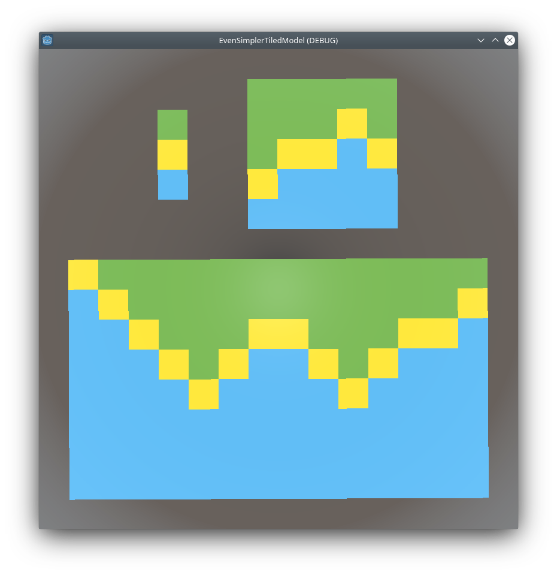

# estm


**E**ven **S**impler **T**iled **M**odel is a Godot Engine port of [Robert Heaton's article](https://robertheaton.com/2018/12/17/wavefunction-collapse-algorithm/) about the [Wave Function Collapse](https://github.com/mxgmn/WaveFunctionCollapse).

This project is mainly used to discover Godot Engine.



## Controls
* MB1: select a color on the top left area (tiles)
* MB2: apply color on the top right area (model)
* Enter: show result of the WFC algorithm on the center area

## Tools
* [Godit Engine](https://godotengine.org/) 3.4
* [gut](https://github.com/bitwes/Gut) 7.1.0

#### Run tests

```bash
godot -d -s --path $PWD addons/gut/gut_cmdln.gd -gdir=res://tests/unit,res://tests/integration -gexit
```

## Resources

### Meshes
* Made with [Blender](https://www.blender.org/) 3.1.2
